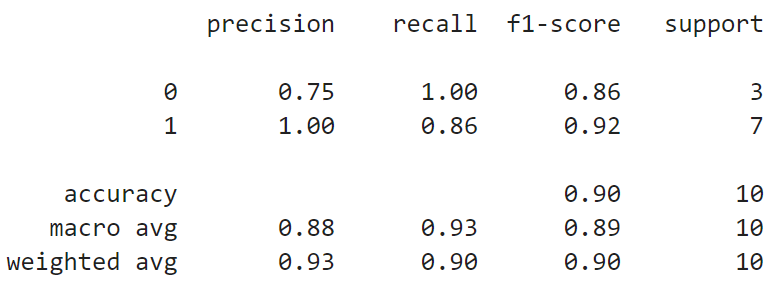
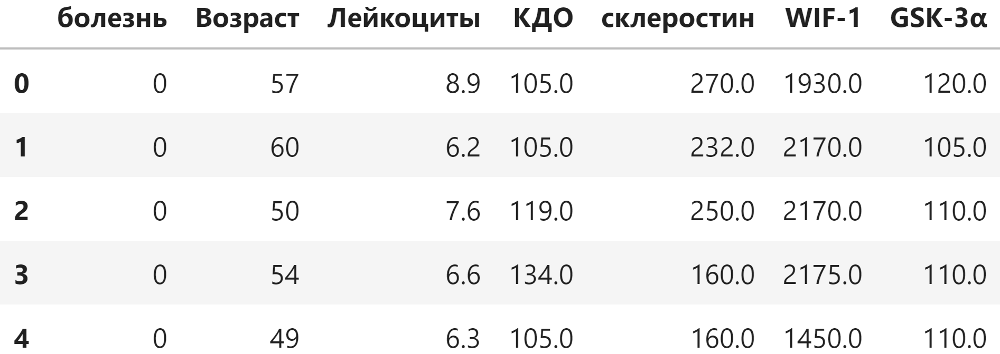
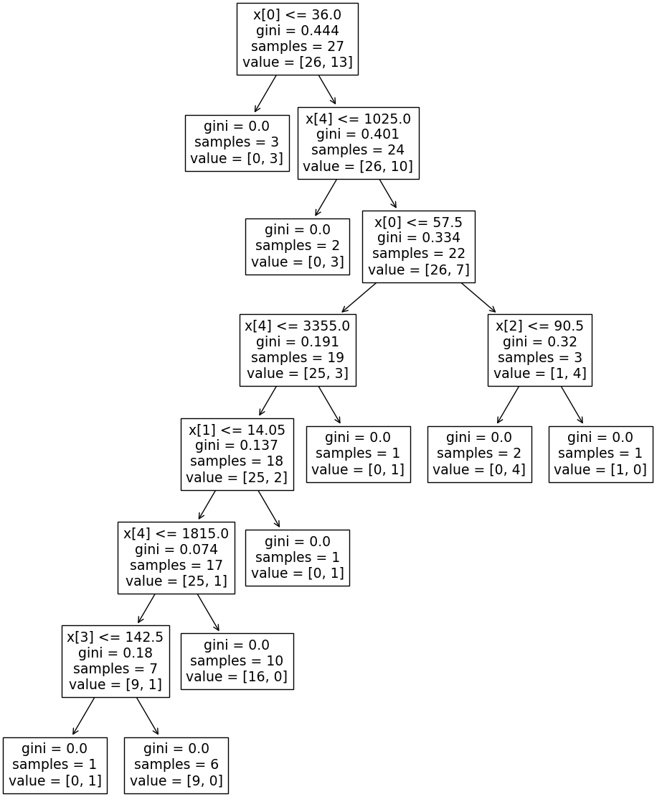

# CoroDetect

Binary classification of cardiovascular disease presence using clinical biomarker data and ensemble machine learning methods.

## Overview

CoroDetect predicts the presence of cardiovascular disease based on a panel of six clinical biomarkers. The model uses a Random Forest classifier trained on patient laboratory data.

## Results

<p align="center">
  
</p>

## Dataset

The dataset contains laboratory measurements for 49 patients with binary labels indicating cardiovascular disease presence.

| Feature | Description |
|---------|-------------|
| Age | Patient age |
| Leukocytes | White blood cell count |
| EDV (КДО) | End-diastolic volume |
| Sclerostin | Sclerostin protein level |
| WIF-1 | Wnt Inhibitory Factor 1 |
| GSK-3α | Glycogen synthase kinase 3 alpha |

<p align="center">
  
</p>

## Model

**Algorithm**: Random Forest Classifier (scikit-learn)  
**Train/Test split**: 80% / 20% (random_state=42)

<p align="center">
  
</p>

## Project Structure

```
├── .gitignore
├── LICENSE
├── README.md
├── requirements.txt
├── notebooks/
│   └── training.ipynb          # Model training and evaluation notebook
├── models/
│   └── random_forest.pkl       # Trained Random Forest model
├── data/
│   └── biomarkers.csv          # Clinical biomarker dataset
└── assets/
    ├── metrics.png
    ├── table_data.png
    └── tree.png
```

## Quick Start

```python
import pickle

with open("models/random_forest.pkl", "rb") as f:
    model = pickle.load(f)

# Predict: [Age, Leukocytes, EDV, Sclerostin, WIF-1, GSK-3α]
prediction = model.predict([[55, 7.2, 140, 35.5, 0.8, 12.3]])
```

## Requirements

- Python 3.10+
- numpy
- pandas
- matplotlib
- scikit-learn

## License

MIT
