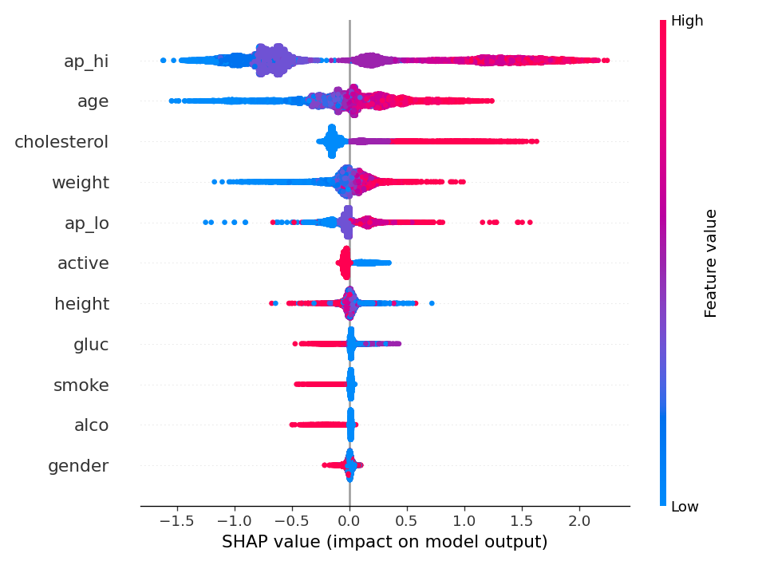

# cardio-risk-rf

[](https://github.com/kiselyovd/cardio-risk-rf/actions/workflows/test.yml)
[](https://kiselyovd.github.io/cardio-risk-rf/)
[](https://github.com/kiselyovd/cardio-risk-rf/actions/workflows/test.yml)
[](LICENSE)
[](https://www.python.org/)
[](https://huggingface.co/kiselyovd/cardio-risk-rf)

Промышленный табличный классификатор сердечно-сосудистого риска на Framingham Heart Study (4240 пациентов, 10-летний риск CHD). Основная модель — **LightGBM** с нативной обработкой NaN и объяснимостью через SHAP; baseline — **RandomForest** с медианной импутацией. Конфигурация через Hydra, подбор гиперпараметров через Optuna, метрики ROC-AUC / PR-AUC / F1 / Brier + calibration plot, сервинг через FastAPI (`/predict` с локальным SHAP top-5), дистрибуция через Hugging Face Hub и MkDocs Material.

> **Часть [ML-портфолио kiselyovd](https://github.com/kiselyovd#ml-portfolio)** — промышленные ML-проекты, основанные на одном [cookiecutter-шаблоне](https://github.com/kiselyovd/ml-project-template).

📖 [Документация (EN)](https://kiselyovd.github.io/cardio-risk-rf/) • 🇬🇧 [English README](README.md) • 🤗 [Модель на HF Hub](https://huggingface.co/kiselyovd/cardio-risk-rf)

## Датасет

[sulianova Cardiovascular Disease Dataset](https://www.kaggle.com/datasets/sulianova/cardiovascular-disease-dataset). 70 000 строк × 11 клинических признаков, **сбалансированный** таргет `cardio` (50/50). Признаки: возраст, пол, рост/вес, систолическое/диастолическое АД, холестерин и глюкоза (ординальные 1-2-3), курение/алкоголь/активность. Загружается через `scripts/sync_data.sh` с Kaggle, fallback — зеркало HF Datasets. Разбиение 70/15/15 со стратификацией по таргету (`train=48999, val=10500, test=10501`). Исходный [Framingham Heart Study](https://www.kaggle.com/datasets/aasheesh200/framingham-heart-study-dataset) (4240 строк, 10-летний проспективный CHD) сохранён как вторичная когорта в `notebooks/02_benchmark.ipynb`.

Исходный 49-строчный датасет от автора `coro-detect` заархивирован в `docs/legacy/original_dataset.csv` — обоснование см. в `docs/legacy/README.md`.

## Результаты

| Модель | ROC-AUC | PR-AUC | F1 @ 0.5 | F1 @ t\* | Brier | t\* |
|---|---|---|---|---|---|---|
| **LightGBM** (основная) | **79.8%** | **78.1%** | 71.9% | **73.8%** | 0.182 | 0.33 |
| RandomForest (baseline) | 79.5% | 77.9% | 70.8% | 73.2% | 0.184 | 0.41 |

Метрики на отложенном test-сплите (n=10 501, сбалансированный таргет, sulianova Cardiovascular Disease Dataset). F1 указан при дефолтном пороге 0.5 и при F1-оптимальном пороге t\*, подобранном на val. Calibration plot на val → `reports/calibration.png`; F1-оптимальные пороги в `reports/metrics_thresholded.json`.

### Глобальный SHAP (основная модель)



## Быстрый старт

```bash
uv sync --all-groups
bash scripts/sync_data.sh
uv run python -m cardio_risk_rf.data.prepare --raw data/raw/framingham.csv --out data/processed
uv run python scripts/train_all.py
```

## Деплой

```bash
docker run --rm -p 8000:8000 ghcr.io/kiselyovd/cardio-risk-rf:v0.1.0
curl -X POST localhost:8000/predict -H 'content-type: application/json' -d @data/widget/sample_patient.json
```

## Лицензия

MIT — см. [LICENSE](LICENSE). Датасет под CC-BY-4.0 (Framingham Heart Study).
