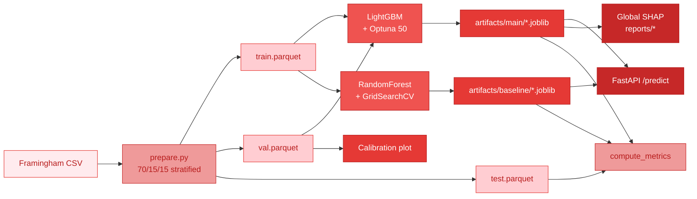

# Architecture

Two independent `sklearn.Pipeline` artefacts sharing the same `{prob, class, shap_top5}` contract.

Key design decisions:
- Main model uses **LightGBM native NaN handling** — no imputer in its pipeline. Missing values at inference (including `/predict`) are forwarded as-is.
- Baseline uses `SimpleImputer(strategy="median")` because RandomForest cannot split on NaN. No `StandardScaler` (tree models are scale-invariant).
- Class imbalance handled by `scale_pos_weight = N_neg / N_pos` (LGBM) and `class_weight="balanced"` (RF).
- Hyperparameter search: Optuna 50 trials for LGBM (TPE sampler, seed=42, early-stopping on val), GridSearchCV short grid for RF.
- Final metric table uses **test set only**; calibration plot uses **val** to avoid test-set contamination.
